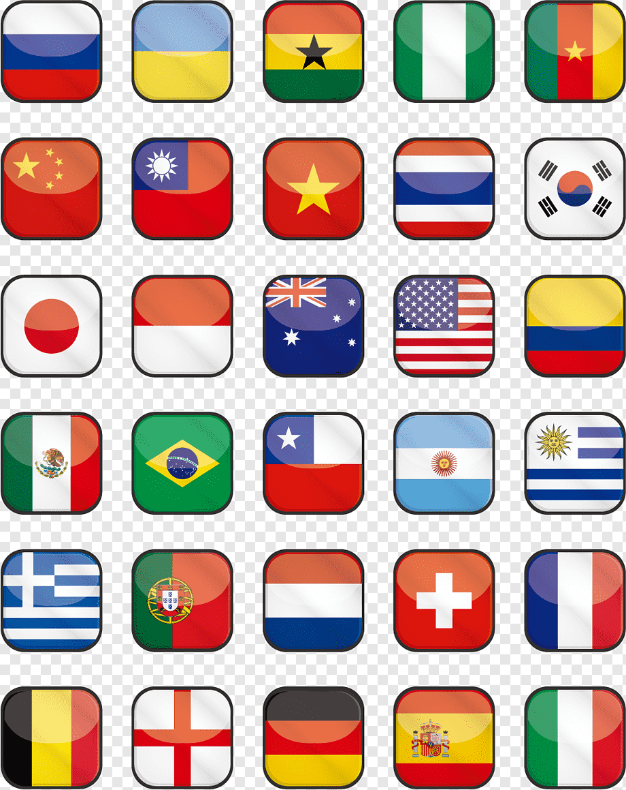

<<<<<<< HEAD
# Buscador de Países 

=======
 

    <h1>Buscador de Países</h1>
 

  

>>>>>>> 838c2c399085cc5a61a08c5a3b86dde97b30f8f1
Este é um projeto de um buscador de países que permite pesquisar por um país e obter informações relevantes sobre ele, utilizando uma API de dados de países.

# Funcionalidades
Pesquisa por país: Digite o nome de um país no campo de pesquisa e obtenha informações sobre ele. (detalhe: o nome do país deve estar em inglês)
Detalhes do país: Após realizar a pesquisa, você receberá detalhes sobre o país, como nome, capital, população, idioma oficial, moeda e bandeira.
# Tecnologias Utilizadas
HTML
CSS
JavaScript
Bootstrap (opcional, mas recomendado para facilitar a criação do layout responsivo)
Instalação e Uso
Clone ou faça o download deste repositório.
Abra o arquivo index.html em seu navegador.
Configuração da API
Este projeto utiliza uma API de dados de países para obter as informações necessárias. Você precisará obter uma chave de acesso (API key) para poder fazer as solicitações à API.

Acesse o site da API de dados de países e crie uma conta (se necessário) para obter sua chave de acesso.

No arquivo script.js, substitua o valor da constante API_KEY pela sua chave de acesso:

javascript
Copy code
const API_KEY = 'SUA_API_KEY_AQUI';
Salve o arquivo após adicionar sua chave de acesso.

Personalização
Você pode personalizar a aparência e o layout do buscador de países de acordo com suas preferências. O projeto já inclui um arquivo CSS (styles.css) onde você pode adicionar suas próprias regras de estilo.

Contribuição
Contribuições são bem-vindas! Se você tiver ideias de melhorias, correções de bugs ou novos recursos, sinta-se à vontade para abrir uma "issue" ou enviar um "pull request".

Licença
Este projeto está licenciado sob a MIT License.

Agradecimentos
Agradecemos à API de dados de países por fornecer os dados utilizados neste projeto.
