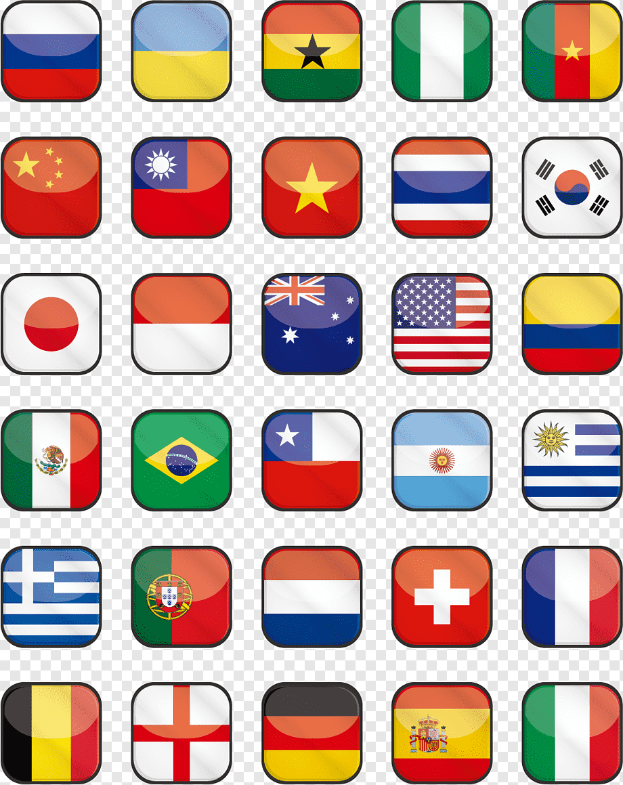
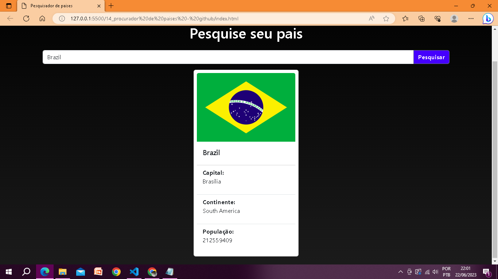

<h1 align="center">Buscador de paises 🔎 </h1>
Este é um projeto de um buscador de países que permite pesquisar por um país e obter informações relevantes sobre ele, utilizando uma API de dados de países.

# 📌Funcionalidades 
  Pesquisa por país: Digite o nome de um país no campo de pesquisa e obtenha informações sobre ele. (detalhe: o nome do país deve estar em inglês)
Detalhes do país: Após realizar a pesquisa, você receberá detalhes sobre o país, como bandeira, nome, capital, continente e população.
## imagem Layout 
  
## Brasil 
 
# Tecnologias Utilizadas
-HTML  
-CSS  
-JavaScript  
-Bootstrap   
# Instalação e Uso
Clone ou faça o download deste repositório.
Abra o arquivo index.html em seu navegador. 
Este projeto utiliza uma API de dados de países para obter as informações necessárias.

# Contribuição
Contribuições são bem-vindas! Se você tiver ideias de melhorias, correções de bugs ou novos recursos, sinta-se à vontade para abrir uma "issue" ou enviar um "pull request".

# Agradecimentos ♥️
Agradeço a API https://restcountries.com/ por fornecer os dados <3.
